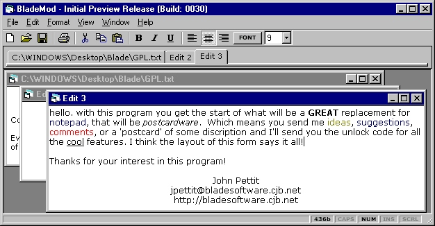



## BladeMod \- Tabbed\-MDI Text Editor

### Description

Here's a great example of how to make a 'real' text editor in VB. This one has a Tabbed-Multiple-Document-Interface (see screen-shot for example)! Users of UltraEdit, NetCaptor or Opera will know what I mean. Commented source should make it easy to apply the interface to your own programs.

This program handles over 128 documents simultaneously, has print functions, clipboard functions and full formatting controls (eg. align, colour, font, size, bold, etc.)  

It took many hours to make, test and debug this program so your vote would be appreciated. Future version will include hex editing, spell checker, DOC and PDF support, full undo/redo, etc... This program will be released as postcardware in future; this means you send me some ideas, suggestions, comment, etc.. and i send you the unlock code so the program isn't retricted. THIS VERSION ISN'T RESTRICTED THOUGH :-) Thanks for you interest! There are links in the help menu & and you can also vote from there. 

if you don't have the VB6 runtimes you can get them here: http://lantis.anu.edu.au/blade/develop/vb/runtimes/VBRUN60.EXE

 

and if you don't have comdlg32.ocx, mscomctl.ocx and richtx32.ocx you can get them here: http://lantis.anu.edu.au/blade/develop/vb/controls/
 
### More Info
 

             |
---                |---
**Submitted On**   |2000-07-07 17:36:50
**By**             |[John Pettit](https://github.com/Planet-Source-Code/PSCIndex/blob/master/ByAuthor/john-pettit.md)
**Level**          |Intermediate
**User Rating**    |4.9 (131 globes from 27 users)
**Compatibility**  |VB 3\.0, VB 4\.0 \(16\-bit\), VB 4\.0 \(32\-bit\), VB 5\.0, VB 6\.0, VB Script, ASP \(Active Server Pages\) 
**Category**       |[Complete Applications](https://github.com/Planet-Source-Code/PSCIndex/blob/master/ByCategory/complete-applications__1-27.md)
**World**          |[Visual Basic](https://github.com/Planet-Source-Code/PSCIndex/blob/master/ByWorld/visual-basic.md)
**Archive File**   |[CODE\_UPLOAD7502772000\.zip](https://github.com/Planet-Source-Code/john-pettit-blademod-tabbed-mdi-text-editor__1-9568/archive/master.zip)

